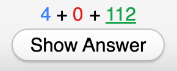

# Toggle Remaining Card Counts

**AnkiWeb Page: https://ankiweb.net/shared/info/1489494509**



This add-on allows you to toggle visibility of the Remaining Card Count (pictured above) using either a keyboard shortcut or an Anki Menu Bar item.

The default keyboard shortcut is the backtick/grave accent key (`), which is to the left of the number "1" on the US QWERTY keyboard. This shortcut can be configured in the add-on's config JSON.

### Example Add-On Configuration
To change the keyboard shortcut, open Tools > Add-ons, then select this add-on and click the "Config" button. For example, the following configuration:
```json
{
    "shortcut": "Ctrl+Shift+8"
}
```
will change the keyboard shortcut to `Ctrl`+`Shift`+`8` (`Cmd`+`Shift`+`8` on Mac).
